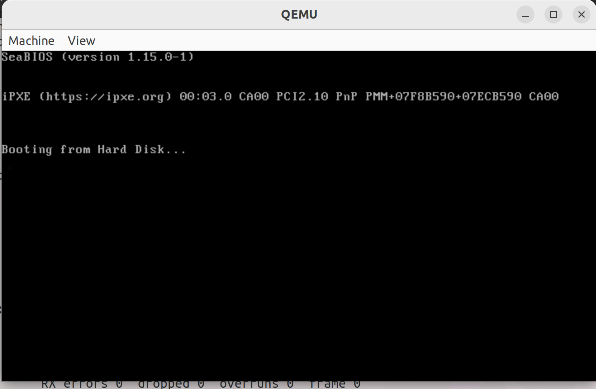

### Theory
When the computer boots, the BIOS doesn't know how to load the OS, so it delegates that task to the boot sector. Thus, the boot sector must be placed in a known, standard location. That location is the first sector of the disk (cylinder 0, head 0, sector 0) and it takes 512 bytes.

To make sure that the "disk is bootable", the BIOS checks that bytes 511 and 512 of the alleged boot sector are bytes 0xAA55.

This is the simplest boot sector ever:
```
e9 fd ff 00 00 00 00 00 00 00 00 00 00 00 00 00
00 00 00 00 00 00 00 00 00 00 00 00 00 00 00 00
[ 29 more lines with sixteen zero-bytes each ]
00 00 00 00 00 00 00 00 00 00 00 00 00 00 55 aa
```
It is basically all zeros, ending with the 16-bit value 0xAA55 (beware of endianness, x86 is little-endian). The first three bytes perform an infinite jump

### Environment
- Start ubuntu 22.04 on virtual box 
- Install nasm and qemu
```
 sudo apt install nasm
 sudo apt install qemu
```

### Simplest boot sector ever
```
$ vim boot_sector.asm
; Infinite loop (e9 fd ff)
loop:
    jmp loop 

; Fill with 510 zeros minus the size of the previous code
times 510-($-$$) db 0
; Magic number
dw 0xaa55  
```
- Compile and Run
```
$ nasm -f bin boot_sector.asm -o boot_sector.bin
$ qemu-system-x86_64 ./boot_sector.bin 
```


